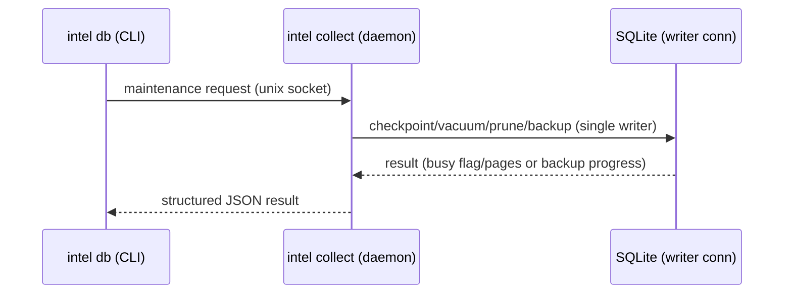

# Spec 006: Intelligence Tool

## Problem

The predecessor system (Rising Intelligence) is a 4-service Kafka-centric system (Collector, Persister, Trends, Brief) that collects tech/AI/AWS signals, detects trends, and generates briefs. It works, but the architecture is disproportionate to the problem: single operator, home network, ~500 events/day. Kafka, Postgres, Redis, Docker Compose, Prisma, protobuf, OpenTelemetry — the infrastructure cost dominates the value delivered.

More importantly, the data is locked inside the pipeline. Agents can't query it. The brief is generated via Kafka request/response, not callable from a CLI or tool. The system produces intelligence but doesn't make it *accessible*.

## Goal

Redesign as a lightweight tool in `tools/intelligence/` that:

1. **Collects data** continuously from curated sources (RSS, HN, Lobsters, EDGAR, Earnings)
2. **Exposes intelligence** as CLI commands and MCP tools that agents can invoke
3. **Runs on SQLite** — no Postgres, no Redis, no Kafka, no Docker required

The collector runs as a daemon. Everything else is on-demand query. Agents synthesize their own analysis from the raw data — the tool provides the data, not the interpretation.

## Non-Goals

- Multi-user access or concurrent write safety (single operator)
- Sub-minute data freshness (5-minute poll intervals are fine)
- Dashboard UI (CLI output replaces Grafana)
- Event replay or stream processing (SQLite is the store, not an event log)
- Backward compatibility with the predecessor system

## Architecture

```
┌──────────────────────────────────────────────────────────────┐
│  tools/intelligence/                                         │
│                                                              │
│  ┌─────────────────┐         ┌──────────────────────────┐    │
│  │ intel collect   │────────▶│  intelligence.db         │    │
│  │                 │  write  │                          │    │
│  │ - poll feeds    │         │  events                  │    │
│  │ - extract       │         │  events_fts              │    │
│  │ - classify      │         │  checkpoints             │    │
│  │ - checkpoint    │         │  collector_health        │    │
│  └─────────────────┘         │                          │    │
│                              └──────────┬───────────────┘    │
│                                         │ read               │
│  ┌─────────────────┐                    │                    │
│  │ intel trends    │◀───────────────────┤                    │
│  │ intel search    │◀───────────────────┤                    │
│  │ intel events    │◀───────────────────┤                    │
│  │ intel sources   │◀───────────────────┘                    │
│  └─────────────────┘                                         │
│        │                                                     │
│        ▼                                                     │
│  JSON (stdout) ──▶ agent context / human reading             │
└──────────────────────────────────────────────────────────────┘
```

Two concerns, one binary:

| Concern | Runs as | Reads/Writes |
|---------|---------|-------------|
| **Collector daemon** | Long-running process (`intel collect`) | Writes events + checkpoints |
| **Query tools** | On-demand CLI commands | Reads events (read-only) |

Both share the same SQLite file. SQLite WAL mode handles this safely — readers don't block writers, writers don't block readers — without coordination infrastructure.

### SQLite Configuration

Configuration is split into two concerns: one-time database initialization and per-connection setup.

**Database initialization** (run once at creation, or via migration with `VACUUM`):

```sql
PRAGMA journal_mode = WAL;
PRAGMA auto_vacuum = INCREMENTAL;
PRAGMA application_id = 0x494E5445;  -- 'INTE' in ASCII; identifies this as an intel DB
```

`auto_vacuum = INCREMENTAL` must be set before any tables are created. Changing this on an existing database requires setting the pragma and then running `VACUUM` to reorganize. In incremental mode, free pages are not reclaimed at commit — reclamation requires an explicit `PRAGMA incremental_vacuum` call (exposed via `intel db incremental-vacuum`).

`application_id` is a 32-bit signed big-endian integer stored in the database file header (bytes 68–71). It allows tools like `file(1)` and the tool's own code to distinguish an intel database from a generic SQLite file. This is separate from `user_version`, which is reserved for schema migration versioning. The value `0x494E5445` is the ASCII encoding of `INTE`. Current SQLite uses only the lower 31 bits of `application_id`; higher bits are ignored — choose IDs accordingly (the chosen value fits within 31 bits). Check `magic.txt` in the SQLite source to avoid collisions with other assigned application IDs. On DB open, `db.ts` should verify the `application_id` matches (or is zero, for a fresh database) before proceeding — this catches "wrong file" errors early.

**Writer connection** (collector daemon):

```sql
-- Set via better-sqlite3: new Database(path, { timeout: 5000 })
PRAGMA synchronous = NORMAL;
PRAGMA foreign_keys = ON;
PRAGMA trusted_schema = OFF;
PRAGMA wal_autocheckpoint = 1000;  -- explicit; from collector.wal_autocheckpoint config

-- Optional: cap on-disk WAL/journal size left behind after checkpoints/resets.
-- Does not prevent WAL growth under checkpoint starvation; it just avoids
-- leaving huge WAL files on disk once a reset or truncate checkpoint occurs.
-- Negative = no limit (SQLite default -1); zero = truncate to minimum after
-- each commit/WAL reset/checkpoint event. A finite cap (e.g., 64–256 MB) is
-- recommended over -1 to bound disk usage after content spikes.
PRAGMA journal_size_limit = 67108864;  -- 64 MB; from collector.journal_size_limit_bytes config
```

**Reader connections** (CLI commands, MCP tool calls):

```sql
-- Set via better-sqlite3: new Database(path, { readonly: true, timeout: 5000 })
PRAGMA query_only = ON;
PRAGMA trusted_schema = OFF;
```

`PRAGMA trusted_schema = OFF` is a defense-in-depth measure recommended in SQLite's security documentation. It prevents SQL functions embedded in schema definitions (triggers, views, CHECK constraints) from running with elevated trust. Since the database ingests arbitrary web content and the schema is fully controlled by this tool, there is no legitimate need for trusted schema, and the downside risk is minimal.

`readonly: true` prevents accidental writes at the library level. `PRAGMA query_only = ON` adds a SQLite-level guard — any CREATE/INSERT/UPDATE/DELETE attempt fails with `SQLITE_READONLY`. Together they mechanically enforce the "tool provides data; collector is the only writer" principle.

**Pragma verification:** Pragmas may behave differently across SQLite versions and builds; for correctness-critical pragmas, set the value and read it back. For all correctness-critical pragmas (`journal_mode`, `wal_autocheckpoint`, `query_only`, `trusted_schema`, `foreign_keys`, `synchronous`, `journal_size_limit`), set the value and then read it back in the same connection setup. If the read-back value doesn't match, log a warning and surface it in `intel stats`. This catches version mismatches (e.g., a pragma not supported by the embedded SQLite) and configuration drift without silent failure. Example: after `PRAGMA trusted_schema = OFF`, execute `PRAGMA trusted_schema` and assert the result is `0`.

**Lock-wait semantics:** `better-sqlite3`'s `options.timeout` is the canonical "wait before SQLITE_BUSY" knob (default 5000ms). Do not also set `PRAGMA busy_timeout` — the library handles this, and having two conflicting values causes confusion. Even with a timeout, `SQLITE_BUSY` can still occur in WAL mode during checkpoint cleanup, crash recovery, or when SQLite detects a potential deadlock (in which case the busy handler is skipped entirely). All CLI commands and MCP tool calls must treat `SQLITE_BUSY` as a first-class, expected error — not an exceptional crash — with bounded retries (2–4 attempts, exponential backoff + jitter) and an actionable error message. See **Error Taxonomy** below.

**Durability trade-off:** `synchronous = NORMAL` is a deliberate choice. In WAL mode, NORMAL syncs the WAL before each checkpoint but skips extra syncs after most commits. The risk profile is narrow: durability is preserved across application crashes and normal process termination. The only scenario where committed transactions can be lost is an OS-level crash or power failure before the WAL is synced — and even then, the database remains consistent (no corruption), just missing the most recent uncheckpointed commits. This is acceptable for a home-lab tool collecting publicly available data. For stronger guarantees, set `synchronous = FULL` at a performance cost (configurable via `collector.synchronous` in config).

**Operational constraints:**

- WAL mode requires all processes on the same host — it relies on shared-memory coordination and is not safe over network filesystems (NFS, SMB). The database is not portable via Dropbox/iCloud sync.
- WAL produces `-wal` and `-shm` sidecar files alongside the database. Naive file copies can produce a corrupt backup — use `intel db backup` (which uses `better-sqlite3`'s online backup API) instead.
- **Short-lived read transactions:** WAL checkpoints can be starved by long-running readers — perpetual overlapping readers can prevent checkpoint completion and cause unbounded WAL growth. Every CLI command and MCP tool call must follow: open connection → query → close. Pagination uses cursor tokens between separate short transactions, not a single long streaming read.
- **Concurrent process awareness:** The collector daemon, MCP server, and CLI commands can all run simultaneously — this is by design. However, avoid running high-frequency CLI queries concurrently with the MCP server, as overlapping readers can prevent checkpoint completion. Under normal usage (intermittent CLI calls, occasional MCP tool invocations), reader gaps are naturally present and checkpoints proceed without issue.
- **Single checkpoint authority:** Only the collector writer connection may run checkpoint, vacuum, prune, backup, and other write-adjacent maintenance operations. This eliminates the risk of two connections attempting to checkpoint or write simultaneously — a concurrency shape that can trigger corruption due to the "WAL-reset bug" (present in SQLite 3.7.0 through 3.51.2, where two processes checkpointing at the same instant can rarely corrupt the database). CLI `intel db` maintenance commands coordinate with the daemon: if the daemon is running, they send the request via the daemon's control channel (see below); if it is not running, they open their own writer connection. This makes "two writers at the same instant" structurally impossible. (The WAL-reset bug is fixed in 3.52.0 and backported to 3.44.6, 3.50.7, and 3.51.3.)
- **Daemon control channel:** The collector daemon listens on a Unix domain socket (`$XDG_RUNTIME_DIR/intel/control.sock` or `$TMPDIR/intel-control-<pid>.sock`). CLI maintenance commands (`intel db checkpoint`, `intel db prune`, `intel db vacuum`, `intel db backup`, etc.) check for a running daemon via PID file and, if found, send the maintenance request over this socket rather than opening a separate writer connection. This is local process control, not a service — no network, no auth, no serialization protocol beyond newline-delimited JSON.



- **SQLite version awareness:** The embedded SQLite version (from `better-sqlite3`'s bundled build) is recorded at startup and surfaced in `intel stats`. The WAL-reset bug fix is present only if the version satisfies one of: `>= 3.52.0`, or `3.51.x with patch >= 3`, or `3.50.x with patch >= 7`, or `3.44.x with patch >= 6`. If the version does not satisfy any of these conditions, the tool logs a warning at startup and enforces stricter single-writer discipline (no concurrent checkpoint paths; daemon mediation required for all maintenance). Pin to a `better-sqlite3` version that bundles a patched SQLite when available.
- **WAL auto-checkpoint policy:** SQLite's default auto-checkpoint threshold is 1000 WAL pages, controlled by `PRAGMA wal_autocheckpoint`. This is set explicitly at writer connection startup (not left implicit) and exposed as `collector.wal_autocheckpoint` in config (default: 1000). Lowering the value reduces peak WAL size but increases checkpoint frequency; raising it reduces checkpoint overhead but allows larger WAL files. The `intel db checkpoint` command reports the checkpoint result triple: busy flag, total WAL pages, and checkpointed pages.
- **Periodic optimizer:** The collector daemon should run `PRAGMA optimize` periodically (e.g., daily) to let SQLite update internal statistics used by the query planner. This is recommended by SQLite for long-lived connections and has negligible cost.

## Data Model

### SQLite Schema

```sql
-- Collected events (append-only, deduped by event_id)
CREATE TABLE events (
    id          INTEGER PRIMARY KEY AUTOINCREMENT,
    event_id    TEXT    UNIQUE NOT NULL,           -- stable per-source ID
    source      TEXT    NOT NULL CHECK(source IN ('rss','hackernews','lobsters','edgar','earnings')),
    feed        TEXT,                              -- feed name/identifier
    url           TEXT,
    canonical_url TEXT,                            -- normalized URL for cross-source dedup
    title       TEXT,
    content     TEXT,                              -- extracted article body
    author      TEXT,
    published_at TEXT,                             -- ISO 8601 UTC
    fetched_at  TEXT    NOT NULL,                  -- ISO 8601 UTC
    topics      TEXT    NOT NULL DEFAULT '[]' CHECK (json_valid(topics)),
    tags        TEXT    NOT NULL DEFAULT '[]' CHECK (json_valid(tags)),
    score       INTEGER DEFAULT 0,                -- engagement (upvotes, likes)
    comments    INTEGER DEFAULT 0,
    source_meta     TEXT    CHECK (source_meta IS NULL OR json_valid(source_meta)),
    content_flags   TEXT    CHECK (content_flags IS NULL OR json_valid(content_flags)),
    created_at      TEXT    NOT NULL DEFAULT (strftime('%Y-%m-%dT%H:%M:%fZ', 'now'))
);

CREATE INDEX idx_events_source_fetched  ON events(source, fetched_at);
CREATE INDEX idx_events_fetched         ON events(fetched_at);
CREATE INDEX idx_events_published       ON events(published_at);
CREATE INDEX idx_events_canonical_url   ON events(canonical_url) WHERE canonical_url IS NOT NULL;

-- Full-text search
CREATE VIRTUAL TABLE events_fts USING fts5(
    title,
    content,
    content='events',
    content_rowid='id',
    tokenize="unicode61 tokenchars '-_' remove_diacritics 1"
);

-- Keep FTS in sync via triggers
CREATE TRIGGER events_fts_insert AFTER INSERT ON events BEGIN
    INSERT INTO events_fts(rowid, title, content) VALUES (new.id, new.title, new.content);
END;
CREATE TRIGGER events_fts_delete AFTER DELETE ON events BEGIN
    INSERT INTO events_fts(events_fts, rowid, title, content)
        VALUES ('delete', old.id, old.title, old.content);
END;

CREATE TRIGGER events_fts_update AFTER UPDATE OF title, content ON events BEGIN
    INSERT INTO events_fts(events_fts, rowid, title, content)
        VALUES ('delete', old.id, old.title, old.content);
    INSERT INTO events_fts(rowid, title, content)
        VALUES (new.id, new.title, new.content);
END;

-- FTS tokenizer notes:
-- unicode61 with tokenchars '-_' treats hyphens and underscores as token characters,
-- so "CVE-2026-12345", "k8s-gateway", and "bedrock_agents" are matched as whole tokens.
-- remove_diacritics normalizes accented characters for consistent matching.
-- Porter stemming is deliberately omitted: it can produce surprising results for
-- technical acronyms (RAG, EKS) and domain-specific terms. If stemming is needed
-- later, wrap as: tokenize="porter unicode61 tokenchars '-_' remove_diacritics 1"
--
-- FTS5's trigram tokenizer enables substring matching and LIKE/GLOB optimization
-- but increases index size. Available as a future opt-in if "search inside tokens"
-- becomes a requirement.

-- Normalized topic index for fast topic queries and trend computation
CREATE TABLE event_topics (
    event_id TEXT NOT NULL,
    topic    TEXT NOT NULL,
    PRIMARY KEY (event_id, topic),
    FOREIGN KEY (event_id) REFERENCES events(event_id) ON DELETE CASCADE
);
CREATE INDEX idx_event_topics_topic ON event_topics(topic);

-- Per-source polling cursors
CREATE TABLE checkpoints (
    source     TEXT NOT NULL,
    feed       TEXT NOT NULL DEFAULT '',           -- feed identifier within source
    cursor     TEXT NOT NULL,                     -- last-seen ID or timestamp
    updated_at TEXT NOT NULL,
    PRIMARY KEY (source, feed)
);

-- Collector health: updated each poll cycle, even when no new events are found
CREATE TABLE collector_health (
    source          TEXT NOT NULL,
    feed            TEXT NOT NULL DEFAULT '',
    last_polled_at  TEXT NOT NULL,                -- ISO 8601 UTC
    last_success_at TEXT,                         -- last poll that completed without error
    last_error      TEXT,                         -- most recent error message, if any
    events_in_poll  INTEGER NOT NULL DEFAULT 0,   -- events found in last poll
    http_etag       TEXT,                         -- ETag from last successful response
    http_last_modified TEXT,                      -- Last-Modified from last successful response
    PRIMARY KEY (source, feed)
);

-- Data retention: events older than retention_days are prunable
-- Enforced by `intel db prune`
```

### Topic Storage

Topics are stored in two places: as a JSON array in `events.topics` and in the `event_topics` side table. The collector populates both at insert time.

**Canonicality:** `events.topics` (the JSON array) is the canonical representation — it's what the classifier produced and what the API returns. `event_topics` is a derived index optimized for queries and trend computation. If the two diverge (e.g., after a reclassification run that updates only the JSON column), `intel db rebuild-topic-index` rebuilds `event_topics` from the JSON using `json_each`. This unidirectional flow (JSON → side table) eliminates the risk of circular divergence.

**Schema versioning:** `db.ts` manages migrations from a `migrations/` directory and tracks the current version via `PRAGMA user_version` (a SQLite-reserved integer that the engine itself does not use, leaving it entirely to applications). Migrations are applied in deterministic numeric order (001, 002, ...) and each migration runs within a transaction: `PRAGMA user_version` is set only after the migration transaction commits successfully, so a partial migration never bumps the version. On startup, `db.ts` compares `PRAGMA user_version` against available migration files and applies any pending ones sequentially. The `intel db schema` command shows the current `user_version` (schema version), `application_id`, and whether migrations are pending.

**Note on timestamp comparisons:** All time-range filters must use `strftime('%Y-%m-%dT%H:%M:%fZ', ...)` — not `datetime()` — because `datetime()` returns `YYYY-MM-DD HH:MM:SS` which won't compare correctly against the stored `YYYY-MM-DDTHH:MM:SS.000Z` format.

```sql
-- Events matching a topic (uses indexed side table)
SELECT e.* FROM events e
JOIN event_topics et ON et.event_id = e.event_id
WHERE et.topic = 'aws.bedrock'
  AND e.fetched_at >= strftime('%Y-%m-%dT%H:%M:%fZ', 'now', '-7 days');

-- Topic volume in a time window (uses indexed side table)
SELECT et.topic, COUNT(*) AS volume
FROM event_topics et
JOIN events e ON e.event_id = et.event_id
WHERE e.fetched_at >= strftime('%Y-%m-%dT%H:%M:%fZ', 'now', '-60 minutes')
GROUP BY et.topic
ORDER BY volume DESC;

-- Topic volume with cross-source dedup (count distinct stories, not distinct events)
SELECT et.topic, COUNT(DISTINCT COALESCE(e.canonical_url, e.event_id)) AS volume
FROM event_topics et
JOIN events e ON e.event_id = et.event_id
WHERE e.fetched_at >= strftime('%Y-%m-%dT%H:%M:%fZ', 'now', '-60 minutes')
GROUP BY et.topic
ORDER BY volume DESC;
```

## CLI Interface

Single binary: `intel`. All commands output JSON to stdout by default (agent-friendly). Human-readable output via `--format text`.

### Output Contract

All JSON outputs use a consistent envelope so agents can parse responses predictably:

```json
{
  "tool": "intel",
  "schema_version": "v1",
  "status": "ok",
  "data": { },
  "warnings": [],
  "next_cursor": null
}
```

**Size controls** prevent context explosions when agents consume output:

- `--limit N` — cap result count (default varies per command)
- `--cursor <token>` — resume from a previous result set

**Cursor semantics:** Each paginated command defines deterministic ordering so that cursors are stable even when new events arrive between pages:

- `intel events`: `ORDER BY fetched_at DESC, event_id DESC`
- `intel search`: `ORDER BY fts_rank ASC, event_id DESC` (FTS5 rank/bm25: lower is better)
- `intel trends`: not paginated (bounded result set)

The cursor token encodes the last-seen sort key tuple (e.g., `{ fetched_at, event_id }`) and resumes with a strict "less than" filter. This prevents duplicate or missing rows across pages. Cursor tokens are opaque base64-encoded JSON and include `schema_version` and `command` fields alongside the sort keys. This allows future changes to ordering or pagination logic to be detected (stale cursor → clear error) rather than silently producing wrong results.

Every paginated response includes explicit pagination metadata so agents can decide whether to fetch more without inferring from cursor presence:

```json
{
  "returned_count": 20,
  "limit_applied": 20,
  "truncated": true,
  "next_cursor": "eyJmZXRjaGVkX2F0Ijoi..."
}
```

`truncated: true` means more results exist beyond the current page. `returned_count` is the number of items in this response. `limit_applied` is the effective limit used (explicit or default).

**Error taxonomy:** Error responses use the same envelope with `"status": "error"` and a structured `error` object so agents can decide whether to retry or escalate without parsing stack traces:

```json
{
  "tool": "intel",
  "schema_version": "v1",
  "status": "error",
  "error": {
    "code": "SQLITE_BUSY",
    "message": "Database is busy (WAL checkpoint/write contention).",
    "retryable": true,
    "suggested_action": "Retry in a moment, or stop collector before running maintenance commands."
  }
}
```

Error codes: `SQLITE_BUSY` (retryable — lock contention), `INVALID_QUERY` (not retryable — bad parameters), `DB_NOT_FOUND` (not retryable — database file missing), `COLLECTOR_NOT_RUNNING` (not retryable — daemon required for this command), `INVALID_CURSOR` (not retryable — cursor is malformed, expired, or from a different schema version), `INTERNAL_ERROR` (not retryable — unexpected failure). MCP tool calls return the same error structure within the JSON-RPC error response.

`SQLITE_BUSY` suggested actions are context-dependent: for read-only query commands, `suggested_action` is `"Retry in a moment."` (the contention is transient). For `intel db` maintenance commands that require writer access, `suggested_action` is `"Stop the collector daemon before running this maintenance command, or let the daemon handle it via the control channel."`

**Two-stage retrieval** — list commands return IDs + short snippets by default. Full content is only returned when fetching a specific event by ID (`intel events --id ...`). This keeps agent context lean.

### Safe Snippets

Even though the tool provides data (not interpretation), downstream agents often paste snippets into prompts. All text output is sanitized by default:

- Strip control characters and zero-width characters
- Escape `< >` to prevent prompt delimiter confusion
- Truncate to bounded length (configurable, default 500 chars for snippets)
- Flag suspected prompt-injection markers (`[INST]`, `<|system|>`, etc.) in a `snippet_flags` field

Raw unsanitized content is available via `--raw` for commands that return event content.

### `intel collect`

Start the collector daemon. Polls all configured feeds on their intervals, extracts content, classifies topics, writes to SQLite.

```
intel collect                    # foreground (Ctrl+C to stop)
intel collect --daemon           # background (writes PID file)
intel collect --once             # single poll cycle, then exit
intel collect status             # check if daemon is running
intel collect stop               # stop background daemon
```

### `intel trends`

Compute trending topics from recent events. No pre-computed snapshots needed — runs windowed aggregation at query time.

```
intel trends                         # top 10 topics, 60m window
intel trends --window 15m            # 15-minute window
intel trends --top 20                # top 20
intel trends --since 24h             # trends over last 24 hours
intel trends --dedup none            # count all events (skip canonical_url dedup)
```

**Output:**
```json
[
  {
    "topic": "aws.bedrock",
    "score": 8.2,
    "volume": 12,
    "prev_volume": 3,
    "acceleration": 3.0,
    "evidence_count": 12,
    "top_titles": ["AWS Announces Bedrock Agents GA", "..."]
  }
]
```

**Scoring algorithm** (carried forward from Trends service):
```
volume = count of distinct stories (by canonical_url, falling back to event_id)
acceleration = prev_volume > 0
  ? (volume - prev_volume) / prev_volume
  : volume > 0 ? 1.0 : 0.0

score = volume + max(0, acceleration * volume)
```

Volume uses cross-source dedup: if the same article appears via both HN and RSS (same `canonical_url`), it counts as one story, not two. This prevents multi-source duplication from inflating trend scores.

Score is normalized to 0-10 scale across all topics in the result set.

### `intel search <query>`

Full-text search across collected events using FTS5.

```
intel search "bedrock agents"              # search title + content
intel search "CVE-2026" --since 7d         # with time bound
intel search "kubernetes" --source rss     # filter by source
intel search "lambda" --topic aws.lambda   # filter by topic
intel search "RAG" --limit 5              # limit results
```

Search results use FTS5's `snippet()` function to extract contextual fragments around matches, rather than returning full content or naive substrings. `snippet()` selects fragments that maximize distinct query term coverage and favors sentence boundaries — this is better than manual truncation because it stays relevant to the query and reduces context size.

Results are ordered by FTS5's hidden `rank` column, which defaults to `bm25()`. **Lower values indicate better matches** — sort ascending (`ORDER BY rank`), not descending. Using the `rank` column directly (rather than an explicit `bm25()` call) is faster because FTS5 can optimize early termination with LIMIT clauses. The result exposes the score as `fts_rank` to make the "lower is better" semantics explicit to agents. The query pattern is:

```sql
SELECT e.event_id, e.title, e.url, e.source, e.published_at, e.topics,
       snippet(events_fts, 0, '[', ']', '...', 32) AS snippet,
       events_fts.rank AS fts_rank
FROM events_fts
JOIN events e ON e.id = events_fts.rowid
WHERE events_fts MATCH ?
ORDER BY fts_rank ASC, e.event_id DESC
LIMIT ?;
```

Note: `snippet()` max token count must be 1–64; the tool validates this bound in CLI arg parsing, defaulting to 32. Snippet markers use `[` and `]` instead of `<b>`/`</b>` to avoid conflicting with the safe-snippet policy that escapes `<` and `>`.

**Output:**
```json
[
  {
    "event_id": "rss:aws-blog:abc123",
    "title": "Building RAG Applications with Bedrock",
    "url": "https://aws.amazon.com/blogs/...",
    "source": "rss",
    "published_at": "2026-03-13T10:00:00Z",
    "topics": ["aws.bedrock", "ai.rag"],
    "snippet": "...retrieval augmented generation using Amazon [Bedrock]...",
    "fts_rank": -4.12
  }
]
```

### `intel events`

Browse events with filters. List mode returns IDs + snippets; single-event mode returns full content.

```
intel events                                 # last 20 events (IDs + snippets)
intel events --topic aws.bedrock             # by topic
intel events --source hackernews             # by source
intel events --since 3d                      # by time
intel events --limit 50                      # more results
intel events --cursor <token>                # paginate from previous result
intel events --id rss:aws-blog:abc123        # single event (full content)
```

### `intel sources`

Check data source health and freshness.

```
intel sources                    # all sources
intel sources --stale 30m        # only sources not seen in 30+ minutes
```

**Output:**
```json
[
  {
    "source": "rss",
    "feed": "AWS Blog",
    "last_polled_at": "2026-03-13T14:30:00Z",
    "last_success_at": "2026-03-13T14:30:00Z",
    "last_error": null,
    "events_in_last_poll": 3,
    "events_24h": 12,
    "events_total": 3420,
    "status": "healthy"
  }
]
```

Source health is derived from the `collector_health` table (updated every poll cycle, even when no new events are found) joined with event counts. The `status` field is computed: "healthy" if `last_success_at` is within 2x the feed's poll interval, "stale" if older, "error" if `last_error` is non-null.

### `intel topics`

List configured topics from the allowlist.

```
intel topics                     # all topics
intel topics --active            # only topics with events in last 7d
intel topics --match "bedrock"   # filter by keyword
```

### `intel stats`

Database overview.

```
intel stats
```

**Output:**
```json
{
  "database": "~/.local/share/intel/intelligence.db",
  "size_mb": 42.3,
  "sqlite_version": "3.51.3",
  "write_library_version": "3.51.3",
  "application_id": "0x494E5445",
  "schema_version": 1,
  "wal_pages": 42,
  "wal_autocheckpoint": 1000,
  "pragma_verified": true,
  "events_total": 15230,
  "events_24h": 487,
  "events_7d": 3201,
  "sources": 12,
  "topics_active_7d": 38,
  "oldest_event": "2026-02-01T00:00:00Z",
  "newest_event": "2026-03-13T14:35:00Z"
}
```

### `intel pack`

Produce a minimal evidence bundle suitable for downstream agent synthesis. This is not a brief — it is a bounded, pre-assembled dataset that an agent can use to write one. The tool provides evidence; the agent provides interpretation.

```
intel pack                           # default: last 6h, top 10 trends
intel pack --since 24h               # wider window
intel pack --top 5                   # fewer trends
intel pack --max-events 3            # cap evidence events per trend
```

**Output:**
```json
{
  "window": { "start": "2026-03-13T08:00:00Z", "end": "2026-03-13T14:00:00Z" },
  "trends": [
    {
      "topic": "aws.bedrock",
      "score": 8.2,
      "volume": 12,
      "acceleration": 3.0,
      "events": [
        {
          "event_id": "rss:aws-blog:abc123",
          "title": "AWS Announces Bedrock Agents GA",
          "url": "https://aws.amazon.com/blogs/...",
          "source": "rss",
          "published_at": "2026-03-13T10:00:00Z",
          "snippet": "Amazon Web Services announced general availability..."
        }
      ]
    }
  ],
  "source_health": [
    { "source": "rss", "feed": "AWS Blog", "status": "healthy", "events_in_window": 8 }
  ]
}
```

The pack is bounded: default max 10 trends, max 5 events per trend, snippets truncated to 500 chars. All text is sanitized per the safe snippets contract.

### `intel db`

Database maintenance operations. These are escape hatches for operational issues, not part of normal use.

```
intel db schema                 # show schema version, application_id, + pending migrations
intel db rebuild-fts            # drop and rebuild FTS index from events table
intel db rebuild-topic-index    # rebuild event_topics from events.topics JSON
intel db optimize-fts           # merge FTS index segments for faster queries
intel db checkpoint             # force WAL checkpoint (default: PASSIVE)
intel db checkpoint --mode truncate  # PASSIVE | FULL | RESTART | TRUNCATE
intel db prune                  # delete events older than retention_days
intel db vacuum                 # run INCREMENTAL auto_vacuum
intel db incremental-vacuum     # reclaim free pages (PRAGMA incremental_vacuum)
intel db backup <path>          # online backup to target path (default: incremental)
intel db backup <path> --mode vacuum-into  # defragmented archival snapshot
intel db quick-check            # fast integrity check (PRAGMA quick_check)
```

**Writer coordination:** All `intel db` commands that mutate the database (checkpoint, prune, vacuum, backup, rebuild-fts, rebuild-topic-index, optimize-fts) require writer access. If the collector daemon is running, these commands send the request to the daemon via its Unix socket control channel and stream the result back. If the daemon is not running, they open a direct writer connection. This enforces the single-checkpoint-authority invariant (see Operational Constraints) and prevents concurrent writer conflicts.

`rebuild-fts` uses FTS5's `'rebuild'` command to discard the full-text index and reconstruct it from the content table. Use after schema migrations, if the FTS index becomes inconsistent, or if triggers were temporarily disabled. Note: triggers only keep the FTS index consistent for changes after the triggers exist — if the content table was populated before triggers were created (e.g., during a migration), a manual rebuild is required.

`rebuild-topic-index` deletes all rows from `event_topics` and repopulates them from `events.topics` JSON using `json_each`. Use if the two representations diverge, or after reclassification changes. Runs in bounded batches to avoid large write transactions.

`optimize-fts` runs FTS5's `'optimize'` special insert command, which merges all index b-tree segments into a single segment for minimal disk usage and fastest query performance. This can take significant time on large indexes; run it after large prunes, bulk reclassifications, or FTS rebuilds — not as a routine operation. At the expected scale (~15K events/month), this is fast enough to run ad hoc.

`checkpoint` forces a WAL checkpoint. Modes match SQLite's checkpoint API:

- **PASSIVE** (default): checkpoint as many frames as possible without waiting for readers. Safe to run at any time.
- **FULL**: wait for readers to finish, then checkpoint all frames. May block briefly.
- **RESTART**: like FULL, but also resets the WAL file. Ensures the next writer starts at the beginning.
- **TRUNCATE**: like RESTART, but also truncates the WAL file to zero bytes. Best for reclaiming disk space.

The command reports the checkpoint result triple: busy flag (whether the checkpoint was blocked by a concurrent reader/writer), total WAL pages, and checkpointed pages. SQLite's default auto-checkpoint (every ~1000 WAL pages, controlled by `PRAGMA wal_autocheckpoint`) runs PASSIVE checkpoints automatically — the `checkpoint` command is for when you need explicit control. Run `--mode truncate` opportunistically after `intel db prune` and `intel db backup` to reclaim WAL space during these natural maintenance windows.

`incremental-vacuum` runs `PRAGMA incremental_vacuum` to reclaim free pages left by deletions. Run after `intel db prune` to shrink the database file. Accepts an optional `--pages N` to limit the number of pages reclaimed per invocation.

`backup` uses `better-sqlite3`'s `.backup()` API (wrapping SQLite's Online Backup API) to create a consistent snapshot of the live database without blocking readers. When the daemon is running, this executes on the daemon's writer connection via the control channel, ensuring no concurrent writer conflicts. When the daemon is stopped, it opens a direct connection.

**Backup restart behavior:** The Online Backup API read-locks the source only during each `sqlite3_backup_step()` call. If a *different* connection modifies the source database between steps, the backup restarts from the beginning on the next step. Frequent restarts can prevent completion entirely. This is why daemon-mediated backup (single writer) is not merely "nice" but operationally necessary — it ensures the backup connection is the only writer, preventing restart loops.

`backup --mode vacuum-into` is available as an alternative that uses `VACUUM INTO <path>`. This produces a minimal-sized, defragmented copy and purges deleted content (including free pages), but is not incremental and uses more CPU. Prefer this for archival snapshots where size matters; prefer the default online backup for routine operational snapshots where speed matters.

`quick-check` runs `PRAGMA quick_check`, a faster alternative to `PRAGMA integrity_check` that skips some index consistency checks but detects common corruption. Use periodically or after unexpected crashes. The collector daemon should run `quick_check` automatically at startup if a stale PID file is detected (indicating a previous unclean shutdown) and log the result. If corruption is detected, the daemon should refuse to start and surface the error clearly, rather than silently operating on a damaged database.

## Collector Design

### Source Adapters

Carry forward the adapter pattern from the predecessor system. Each adapter implements:

```typescript
interface SourceAdapter {
  source: string;
  fetch(checkpoint: Checkpoint | null): AsyncGenerator<RawEvent>;
}
```

**Adapters to implement (priority order):**

1. **RSS/Atom** — generic feed polling with `rss-parser`. Handles most sources. Supports conditional GET via `ETag` and `If-Modified-Since` headers: the adapter stores the server's `ETag` and `Last-Modified` response headers per feed in `collector_health` and sends them on subsequent requests. When the server returns `304 Not Modified`, the adapter skips parsing entirely. This reduces bandwidth, avoids re-downloading unchanged feeds, and keeps request volumes polite.
2. **Hacker News** — HN API with new/top/best modes. 100ms inter-request delay.
3. **Lobsters** — RSS-based but with tag extraction from Lobsters categories.
4. **EDGAR** — SEC filing RSS with form-type extraction and CIK parsing. Must comply with SEC EDGAR access requirements:
   - **User-Agent**: every request must include a descriptive header: `intel-collector/0.1.0 (<operator-email>)`. The operator email is configured in `config.yaml` under `collector.edgar_contact`.
   - **Rate limit**: hard cap at 10 requests/second (SEC-monitored maximum). The adapter should self-limit well below this — 2 req/s default with configurable ceiling. Config validation must enforce `edgar_max_rps <= 10`; values above 10 are rejected at startup.
   - **Startup validation**: if any feed has `source: edgar`, the collector must validate that `collector.edgar_contact` is set and non-empty, and that `collector.edgar_max_rps` does not exceed 10. Fail fast with a clear error if either check fails — running EDGAR requests without a declared User-Agent risks IP blocks, and exceeding 10 rps risks rate limiting or blocking by the SEC.
   - **Carry forward**: the predecessor's `secUserAgent` mechanism and EDGAR form-type parsing hooks.
5. **Earnings** — SEC filings adapter tracking 10-K and 10-Q form types from a configurable roster of tech companies. Uses the same SEC EDGAR API infrastructure and rate-limiting as the EDGAR adapter. Added via migration 002.

Each adapter manages its own checkpoint (last-seen cursor) stored in the `checkpoints` table.

### Content Extraction

Carry forward from `content-fetcher.ts`:

- Fetch article URL → extract readable content via `@mozilla/readability` + `jsdom`
- **jsdom security:** Readability does not sanitize content, and jsdom can execute scripts and fetch remote resources. Always construct jsdom with `runScripts: "outside-only"` (never `"dangerously"`) and `resources: undefined` (default, no remote resource loading). This prevents fetched pages from executing code or phoning home during extraction.
- **Content is untrusted input:** Readability explicitly states it does not perform security-related input sanitization — interactive/scripting content may persist in output. Even though this tool returns plain text (not HTML), extracted content feeds agent prompts, making prompt injection the relevant threat. The safe snippets contract (control char stripping, injection marker flagging, bounded length) is therefore a correctness requirement, not a nice-to-have.
- Per-domain rate limiting (1 request/second per hostname)
- Blocked domain list (paywalls, login walls)
- Content length bounds (min 100 chars, max 50K chars)
- 10-second timeout per fetch
- Graceful fallback: if extraction fails, keep title + URL only
- **Content flags:** The `content_flags` JSON field records extraction status so downstream agents can assess content trustworthiness. Flags include: `"extracted"` (full content available), `"blocked_domain"` (skipped due to domain blocklist), `"truncated"` (exceeded max length), `"fetch_failed"` (HTTP or parse error), `"injection_markers"` (suspected prompt injection markers detected). Example: `["extracted", "truncated"]`.

### Topic Classification

Carry forward from `topics.allowlist.yaml`:

- ~100 topics with keyword and regex matchers
- Priority-based resolution (highest priority wins when multiple match)
- Top 5 topics per event
- Context-aware matching for short acronyms (RAG, EKS require surrounding terms)
- Market-gate filtering for high-volume feeds (entity term matching)

The `topics.yaml` config file moves to `tools/intelligence/config/topics.yaml`.

### Canonical URL Normalization

When an event has a URL, the collector computes `canonical_url` by:

1. Stripping tracking parameters (`utm_*`, `ref`, `source`, `via`)
2. Removing trailing slashes and fragments
3. Lowercasing the hostname

This enables cross-source story dedup: if HN and an RSS feed both link to the same article, `canonical_url` will match and trend volume counts distinct stories rather than distinct events.

### Poll Loop

```
for each feed in config:
  if time_since_last_poll(feed) < feed.poll_interval:
    continue
  checkpoint = load_checkpoint(feed)
  events = []
  for event in adapter.fetch(checkpoint):         -- async: network I/O
    event.canonical_url = normalize_url(event.url)
    event.topics = classify(event.title, event.content)
    events.push(event)
  for batch in chunk(events, BATCH_SIZE):          -- commit every N events
    BEGIN TRANSACTION                              -- sync: DB writes only
      for event in batch:
        upsert_event(event)           -- ON CONFLICT: enrichment update (see below)
        upsert_event_topics(event)    -- one row per topic
      update_checkpoint(feed, last_event_in_batch)
    COMMIT
  update_collector_health(feed, events.length)     -- outside batch loop
  sleep(jitter(1000, 3000))  -- inter-feed pause
```

**Batch-size cap:** Events are committed in batches (default 100 events per transaction, configurable via `collector.batch_size`). This prevents one unexpectedly chatty feed from creating a single massive write transaction — large transactions create large WAL files because the WAL can't be reset mid-transaction. The checkpoint is updated per batch, so a crash mid-feed loses at most one batch worth of events, which will be re-fetched on the next poll cycle.

**Async/sync boundary:** `better-sqlite3`'s `.transaction()` wrappers do not work with async functions — they commit before awaited work completes. All network I/O (feed fetching, content extraction) must happen outside the transaction. The transaction wraps only the synchronous SQLite inserts.

**Enrichment update policy:** RSS items sometimes update titles or descriptions after initial publication while keeping the same GUID/link. A strict `ON CONFLICT DO NOTHING` would permanently miss improvements — especially if content extraction previously failed. Instead, use an enrichment upsert: on conflict, fill previously-null fields without overwriting existing data.

```sql
INSERT INTO events (event_id, source, feed, url, canonical_url, title, content, author,
                    published_at, fetched_at, topics, tags, score, comments,
                    source_meta, content_flags)
VALUES (?, ?, ?, ?, ?, ?, ?, ?, ?, ?, ?, ?, ?, ?, ?, ?)
ON CONFLICT(event_id) DO UPDATE SET
  content       = COALESCE(events.content, excluded.content),
  canonical_url = COALESCE(events.canonical_url, excluded.canonical_url),
  content_flags = COALESCE(events.content_flags, excluded.content_flags),
  score         = MAX(events.score, excluded.score),
  comments      = MAX(events.comments, excluded.comments),
  fetched_at    = excluded.fetched_at
WHERE events.content IS NULL AND excluded.content IS NOT NULL
   OR events.canonical_url IS NULL AND excluded.canonical_url IS NOT NULL
   OR events.content_flags IS NULL AND excluded.content_flags IS NOT NULL
   OR excluded.score > events.score
   OR excluded.comments > events.comments;
```

`created_at` is never updated — it always reflects "first seen." `fetched_at` updates to the latest refresh timestamp only when enrichment actually occurs (the `WHERE` clause gates this). This preserves append-only semantics for most data while maintaining "best available event record" quality.

### Data Retention

Events older than `retention_days` (default 30) are pruned periodically. The collector handles this automatically, or it can be triggered manually with `intel db prune`.

**Privacy note:** `PRAGMA secure_delete = ON` scrubs deleted content from ordinary tables, but does **not** guarantee removal from FTS5 shadow tables — SQLite's own documentation warns that `secure_delete` only scrubs ordinary tables and that virtual tables (including FTS5) may leave forensic traces in their shadow tables. FTS5 has its own `'secure-delete'` configuration option (set via `INSERT INTO events_fts(events_fts, rank) VALUES('secure-delete', 1)`) which prevents deleted entries from being reconstructable, but is slower and still requires SQLite core `PRAGMA secure_delete = ON` for full file-level protection. If "pruned means unrecoverable" becomes a requirement, the full stack is: FTS5 `secure-delete=1` + `PRAGMA secure_delete = ON` + periodic `intel db rebuild-fts` + `VACUUM`. These are not enabled by default (performance cost). For this tool's use case (publicly available data, single operator), the default retention policy is sufficient.

**FTS5 secure-delete compatibility warning:** If FTS5 `secure-delete=1` is ever enabled, be aware that after rows are updated or deleted with this mode active, older SQLite/FTS5 versions (pre-3.42.0) may refuse to read the FTS table unless it is rebuilt. This is a one-way format change — once rows are deleted with secure-delete enabled, the index is no longer backward-compatible with older SQLite builds.

## Service Management

The collector runs as a long-lived foreground process (`intel collect`). OS-native service managers handle lifecycle concerns — start on boot, restart on crash, log routing — so the `--daemon` flag is unnecessary under managed supervision.

### macOS (launchd)

Template plist at `tools/intelligence/service/launchd/com.intel.collector.plist`. Key properties:

- **`KeepAlive: true`** — launchd restarts the process whenever it exits (crash or clean)
- **`RunAtLoad: true`** — starts automatically on user login
- **`ThrottleInterval: 10`** — minimum 10 seconds between restarts, preventing crash loops
- **`ProcessType: Background`** — signals macOS this is a low-priority background task

Logs route to `~/Library/Logs/intel-collector.log` via `StandardOutPath`/`StandardErrorPath`. The collector writes all diagnostic output to stderr, which launchd captures to the same file.

**Install:** `./service/install.sh` resolves the `intel` binary path and `$HOME` into the plist template, copies it to `~/Library/LaunchAgents/`, and bootstraps the service via `launchctl`.

**Commands:**
```bash
# Status
launchctl print gui/$(id -u)/com.intel.collector

# Manual stop/start
launchctl kickstart -k gui/$(id -u)/com.intel.collector  # restart
launchctl bootout gui/$(id -u)/com.intel.collector        # stop

# Logs
tail -f ~/Library/Logs/intel-collector.log
```

### Linux (systemd)

User unit at `tools/intelligence/service/systemd/intel-collector.service`. Key directives:

- **`Restart=on-failure`** — restarts on non-zero exit; clean shutdowns (SIGTERM → exit 0) stay down
- **`RestartSec=10`** — 10-second delay between restart attempts
- **`StartLimitIntervalSec=60`, `StartLimitBurst=5`** — after 5 failures within 60 seconds, systemd stops retrying (prevents infinite crash loops)
- **`ProtectHome=read-only`, `ProtectSystem=strict`** — security hardening; only `~/.local/share/intel` and runtime dirs are writable
- **`MemoryMax=512M`** — hard memory ceiling

Logs route to the systemd journal. The collector's stderr output is captured automatically.

**Install:** `./service/install.sh` copies the unit to `~/.config/systemd/user/`, enables it, and starts it.

**Commands:**
```bash
# Status
systemctl --user status intel-collector

# Manual control
systemctl --user restart intel-collector
systemctl --user stop intel-collector

# Logs
journalctl --user -u intel-collector -f

# Survive logout (run once)
loginctl enable-linger $USER
```

### Forecast Scheduled Jobs

The forecast learning loop (spec 007, section J2) requires periodic `intel forecast --snapshot` and `intel forecast evaluate` invocations. Without scheduling, topic weights remain at the default 1.0 and the confidence learning loop never runs.

Two additional launchd plists and four systemd units handle this:

| Job | Schedule | launchd plist | systemd timer + service |
|-----|----------|---------------|------------------------|
| **Snapshot** | Weekly (Sundays 03:00) | `com.intel.forecast-snapshot.plist` | `intel-forecast-snapshot.timer` + `.service` |
| **Evaluate** | Daily (04:00) | `com.intel.forecast-evaluate.plist` | `intel-forecast-evaluate.timer` + `.service` |

Key differences from the collector service:

- **One-shot, not daemon**: No `KeepAlive` (launchd) / `Type=oneshot` (systemd). The process runs, completes, and exits.
- **Calendar-triggered**: `StartCalendarInterval` (launchd) / `OnCalendar` (systemd) replaces `RunAtLoad`/`KeepAlive`.
- **Shared log file**: Both jobs log to `~/Library/Logs/intel-forecast.log` (macOS). On Linux, output routes to the systemd journal under separate unit names.
- **Persistent timers** (systemd): `Persistent=true` ensures missed runs (e.g., machine was off) execute on next boot.

The same `install.sh` script handles all three services — collector, forecast-snapshot, and forecast-evaluate — in a single `install`/`uninstall` invocation.

**Commands (macOS):**
```bash
# Status
launchctl print gui/$(id -u)/com.intel.forecast-snapshot
launchctl print gui/$(id -u)/com.intel.forecast-evaluate

# Manual trigger
launchctl kickstart gui/$(id -u)/com.intel.forecast-snapshot
launchctl kickstart gui/$(id -u)/com.intel.forecast-evaluate

# Logs
tail -f ~/Library/Logs/intel-forecast.log
```

**Commands (Linux):**
```bash
# Status
systemctl --user list-timers 'intel-forecast-*'

# Manual trigger
systemctl --user start intel-forecast-snapshot.service
systemctl --user start intel-forecast-evaluate.service

# Logs
journalctl --user -u intel-forecast-snapshot
journalctl --user -u intel-forecast-evaluate
```

### Why Not `--daemon`

The `--daemon` flag and PID file management exist for manual operation without a service manager. Under launchd/systemd supervision, the collector runs in foreground mode:

- The supervisor owns process lifecycle (start, stop, restart) — a self-daemonized process confuses the supervisor's process tracking
- Crash restart is handled by the supervisor, not by the collector re-spawning itself
- Log capture works naturally when stdout/stderr are connected to the supervisor
- PID files become redundant since the supervisor tracks the process directly

The `--daemon` flag remains available for environments without a service manager (e.g., quick manual testing).

### Interaction with Control Channel

The control channel (Unix socket) continues to work under service management. CLI commands like `intel db checkpoint` and `intel collect status` detect the running daemon via PID file and route maintenance requests through the socket. The PID file is written by the control channel's `start()` method regardless of whether the process was launched by a supervisor or manually.

## MCP Server

The CLI commands map 1:1 to MCP tools. An MCP server wrapper (`intel mcp`) exposes them for direct agent integration without shelling out.

```
intel mcp                        # start MCP server (stdio transport)
```

**Tools exposed:**

| Tool | Maps to | Description |
|------|---------|-------------|
| `intel_trends` | `intel trends` | Get trending tech topics with scores |
| `intel_search` | `intel search` | Full-text search across collected intelligence |
| `intel_events` | `intel events` | Browse events by topic, source, time |
| `intel_sources` | `intel sources` | Check data source freshness and health |
| `intel_topics` | `intel topics` | List configured intelligence topics |
| `intel_stats` | `intel stats` | Database statistics and health overview |
| `intel_pack` | `intel pack` | Bounded evidence bundle for agent synthesis |
| `intel_forecast` | `intel forecast` | Forward-looking predictions from topic co-movement and lifecycle analysis (see spec 007) |

The MCP server reads the same SQLite file as the CLI. No separate process needed beyond the collector daemon.

**Transport:** stdio (JSON-RPC over stdin/stdout). The MCP stdio spec requires:

- Messages are newline-delimited JSON-RPC; messages must not contain embedded newlines.
- The server must not write anything to stdout that is not a valid MCP message.
- Diagnostic output goes to stderr only.

Built with `@modelcontextprotocol/sdk` using the standard `StdioServerTransport`. These invariants are testable: acceptance tests should verify that `intel mcp` stdout is parseable as MCP messages only and that logs route to stderr.

**Connection management:** The MCP server opens a reader connection (`readonly: true`, `PRAGMA query_only = ON`) and keeps it for the lifetime of the server process. Each tool call executes a short query and returns — no long-held transactions across calls.

**Remote MCP:** If remote access is needed later, Streamable HTTP transport can be added as a second transport. This requires additional security controls (origin validation, bind to localhost, authentication) and is explicitly out of scope for v1.

## Configuration

Single config file: `~/.config/intel/config.yaml`

```yaml
# Database location
database: ~/.local/share/intel/intelligence.db

# Collector settings
collector:
  poll_interval_seconds: 300        # default interval between polls
  fetch_content: true               # extract article content via Readability
  content_timeout_ms: 10000
  max_content_length: 50000
  retention_days: 30                # prune events older than this
  edgar_contact: user@example.com   # required: email for SEC EDGAR User-Agent
  synchronous: normal                # normal (faster) or full (crash-safe); see SQLite Configuration
  edgar_max_rps: 2                  # EDGAR rate limit (max 10, default 2)
  batch_size: 100                   # max events per write transaction
  wal_autocheckpoint: 1000          # WAL pages before auto-checkpoint (SQLite default)
  journal_size_limit_bytes: 67108864 # max on-disk WAL/journal size after checkpoint (64 MB; -1 = no limit)
  blocked_domains:                  # skip content extraction for these
    - medium.com
    - bloomberg.com

# Feed definitions
feeds:
  - url: https://aws.amazon.com/blogs/aws/feed/
    source: rss
    name: AWS Blog
    category: aws
    poll_interval: 600

  - url: https://aws.amazon.com/blogs/compute/feed/
    source: rss
    name: AWS Compute Blog
    category: aws
    poll_interval: 600

  - url: https://openai.com/blog/rss/
    source: rss
    name: OpenAI Blog
    category: ai
    poll_interval: 900
    request_options:                  # optional per-feed HTTP overrides
      headers:
        User-Agent: "intel-collector/0.1.0"

  - source: hackernews
    name: Hacker News
    modes: [new, top]
    poll_interval: 300
    max_items: 100

  - source: lobsters
    name: Lobsters
    poll_interval: 300

  - source: edgar
    name: SEC EDGAR
    form_types: [8-K, 10-K, 10-Q]
    poll_interval: 900
    entities: ["AMZN", "GOOG", "MSFT", "AAPL", "META", "NVDA"]

  - source: earnings
    name: SEC Earnings
    form_types: [10-K, 10-Q]
    poll_interval: 900
    tickers: ["AMZN", "GOOG", "MSFT", "AAPL", "META", "NVDA"]

# Topic classification
topics_file: ~/.config/intel/topics.yaml   # or embed inline

# Output defaults
output:
  format: json                           # json | text
  timezone: America/New_York             # for text output timestamps
```

## Package Structure

```
tools/intelligence/
├── package.json
├── tsconfig.json
├── README.md
├── config/
│   ├── topics.yaml                      # default topic allowlist
│   └── feeds.example.yaml               # example feed config
├── src/
│   ├── bin.ts                           # CLI entry point (commander/yargs)
│   ├── db.ts                            # SQLite schema init + migrations
│   ├── config.ts                        # YAML config loading + zod validation
│   ├── collector/
│   │   ├── index.ts                     # poll loop orchestration
│   │   ├── adapters/
│   │   │   ├── types.ts                 # SourceAdapter interface
│   │   │   ├── rss.ts                   # RSS/Atom adapter
│   │   │   ├── hackernews.ts            # HN API adapter
│   │   │   ├── lobsters.ts              # Lobsters adapter
│   │   │   ├── edgar.ts                 # SEC EDGAR adapter
│   │   │   └── earnings.ts             # SEC Earnings (10-K/10-Q) adapter
│   │   ├── content-fetcher.ts           # Readability extraction
│   │   ├── topic-classifier.ts          # allowlist matching
│   │   └── checkpoints.ts              # cursor persistence
│   ├── queries/
│   │   ├── trends.ts                    # windowed topic scoring
│   │   ├── search.ts                    # FTS5 queries
│   │   ├── events.ts                    # filtered event browsing
│   │   ├── sources.ts                   # source health queries
│   │   ├── pack.ts                      # evidence bundle assembly
│   │   ├── forecast.ts                  # forward-looking predictions (see spec 007)
│   │   ├── topics.ts                    # topic listing
│   │   └── stats.ts                     # database statistics
│   ├── mcp/
│   │   └── server.ts                    # MCP server (stdio transport)
│   ├── control/
│   │   └── channel.ts                   # Unix socket control channel (daemon ↔ CLI)
│   └── util/
│       ├── time.ts                      # duration parsing, formatting
│       ├── text.ts                      # sanitization, truncation
│       └── url.ts                       # canonical URL normalization
├── service/
│   ├── install.sh                       # cross-platform service installer
│   ├── launchd/
│   │   ├── com.intel.collector.plist            # macOS launchd agent — collector daemon
│   │   ├── com.intel.forecast-snapshot.plist    # macOS launchd agent — weekly forecast snapshot
│   │   └── com.intel.forecast-evaluate.plist    # macOS launchd agent — daily forecast evaluate
│   └── systemd/
│       ├── intel-collector.service              # Linux systemd user unit — collector daemon
│       ├── intel-forecast-snapshot.service       # Linux systemd unit — forecast snapshot (oneshot)
│       ├── intel-forecast-snapshot.timer         # Linux systemd timer — weekly (Sun 03:00)
│       ├── intel-forecast-evaluate.service       # Linux systemd unit — forecast evaluate (oneshot)
│       └── intel-forecast-evaluate.timer         # Linux systemd timer — daily (04:00)
├── tests/
│   ├── topics.test.ts                   # topic classification precision
│   ├── trends.test.ts                   # trend computation
│   ├── search.test.ts                   # FTS queries
│   ├── sanitization.test.ts             # injection patterns, control chars, MCP framing
│   └── mcp-stdio.test.ts               # protocol conformance (stdout is MCP-only)
└── migrations/
    └── 001-initial.sql                  # schema creation
```

## What Carries Forward

### Must keep (core value)

| Component | Source | Why |
|-----------|--------|-----|
| RSS adapter + checkpoints | `apps/collector/src/adapters/rss.ts` | Feed polling with dedup is the foundation |
| HN adapter (new/top/best) | `apps/collector/src/adapters/hackernews.ts` | HN-specific pagination and ranking modes |
| Content fetcher | `apps/collector/src/content-fetcher.ts` | Readability extraction dramatically improves topic precision |
| Topic classifier | `infra/config/topics.allowlist.yaml` | 100+ curated topics with priority resolution |
| Market-gate filtering | `apps/collector/src/adapters/rss.ts` | Prevents high-volume feeds from overwhelming signal |
| Topic precision tests | `apps/collector/tests/topics.test.ts` | Validates classification quality |

### Simplified

| Was | Becomes |
|-----|---------|
| Kafka event streaming | Direct SQLite writes |
| Redis window counters | SQL aggregation at query time |
| Postgres + Prisma | SQLite + better-sqlite3 |
| Proto contracts | TypeScript interfaces + JSON |
| 4 Docker services | 1 Node.js process |
| Docker env vars | Single YAML config |
| npm workspaces monorepo | Single package |

### Dropped

| Component | Why |
|-----------|-----|
| Kafka | No streaming needed; single writer, single reader |
| Redis | SQLite handles dedup, aggregation, and caching |
| Postgres | SQLite handles the data volumes (~500 events/day) |
| Prisma | Direct SQL is simpler for 5 tables |
| Protobuf | JSON everywhere; no cross-language contracts needed |
| Docker Compose | Single process; install and run directly |
| OpenTelemetry | Overkill for single-process tool; structured logs are enough |
| Grafana dashboards | CLI provides the view; `intel trends` replaces a dashboard |
| Persister service | Collector writes directly to SQLite |
| Trends service | Computed at query time from events table |
| Consumer lag tracking | No consumers; collector IS the writer |
| Story-level dedup (Redis) | Replaced by `canonical_url` column + SQL dedup in trend queries |
| Discovery candidates | Can be added later if needed |

## Companion Skill

A skill at `skills/intelligence/SKILL.md` should describe how agents use the tool:

- When to check trends before making recommendations
- How to search for prior art before writing
- How to use events and trends data to ground research tasks
- How to integrate intelligence into other workflows

This is a follow-up to the tool implementation.

## Dependencies

```json
{
  "dependencies": {
    "better-sqlite3": "^11.0.0",
    "rss-parser": "^3.13.0",
    "@mozilla/readability": "^0.5.0",
    "jsdom": "^24.0.0",
    "yaml": "^2.4.0",
    "zod": "^3.23.0",
    "commander": "^12.0.0",
    "@modelcontextprotocol/sdk": "^1.0.0"
  },
  "devDependencies": {
    "typescript": "^5.5.0",
    "vitest": "^2.0.0",
    "@types/better-sqlite3": "^7.6.0",
    "@types/jsdom": "^21.0.0"
  }
}
```

## Dependency Notes

**better-sqlite3** is a synchronous native addon. Prebuilt binaries are available for LTS Node.js versions on common platforms. Two operational considerations:

- Cross-platform distribution may require native compilation if prebuilts are unavailable. Pin to a Node.js LTS version to minimize this friction.
- Synchronous API means long-running queries block the event loop. At the expected data volumes (~500 events/day, ~15K total) with proper indexing, this is not a concern. If query times ever become an issue, `better-sqlite3` supports worker threads for offloading.

**rss-parser** supports passing `requestOptions` (including custom headers and timeouts) to its internal HTTP client. The per-feed `request_options` config leverages this for feeds that require specific User-Agent or authentication headers. HTTP behavior (timeouts, redirects, user agent, retry/backoff) should be unified behind a shared fetch layer used by both RSS fetching and content extraction, so throttling and error handling stay consistent.

## Acceptance Criteria

1. `intel collect --once` polls all configured feeds and writes events to SQLite
2. `intel trends` returns scored topics from recent events
3. `intel search "bedrock"` returns matching events with FTS5 ranking
4. `intel events --topic aws.bedrock --since 7d` returns filtered events
5. `intel sources` shows per-source freshness
6. `intel mcp` starts an MCP server exposing all query tools
7. Topic classification passes the same precision tests as the predecessor system
8. All output defaults to JSON; `--format text` produces human-readable output
9. All JSON output uses the response envelope with `schema_version`, `status`, `data`, `warnings`, and `next_cursor`
10. Text snippets in list output are sanitized (control chars stripped, injection markers flagged)
11. `intel pack` produces a bounded evidence bundle with trends, supporting events, and source health
12. Cross-source events sharing a canonical URL are counted as one story in trend volume
13. EDGAR adapter sends compliant User-Agent header and respects configured rate limit
14. Topic queries use the `event_topics` side table; both `event_topics` rows and `events.topics` JSON are populated at insert time
15. `intel db rebuild-fts` reconstructs the FTS index from the events table
16. All database connections use short-lived transactions; no long-held read locks across pagination boundaries
17. Reader connections open with `readonly: true` and set `PRAGMA query_only = ON`; writer connection does not
18. `intel mcp` stdout contains only valid MCP messages (newline-delimited JSON-RPC); all logs route to stderr
19. `intel db backup <path>` produces a consistent database copy using the online backup API
20. Schema version is tracked via `PRAGMA user_version`; `intel db schema` reports current version and pending migrations
21. EDGAR feeds fail fast at startup if `collector.edgar_contact` is not configured
22. Cursor-based pagination produces no duplicate or missing rows when new events arrive between pages
23. `collector_health` table is updated every poll cycle, even when no new events are found
24. MCP stdio protocol conformance is verified by a CI test: spawn `intel mcp`, send a valid JSON-RPC request, assert stdout contains only valid MCP messages and no stray output (the most common stdio integration failure mode)
25. `intel db rebuild-topic-index` reconstructs `event_topics` from `events.topics` JSON
26. `content_flags` field records extraction status (extracted, blocked_domain, truncated, fetch_failed, injection_markers) for each event
27. RSS adapter sends `If-None-Match` / `If-Modified-Since` headers when prior ETag/Last-Modified values are available, and skips parsing on `304 Not Modified`
28. Text sanitization has unit tests covering: known prompt injection patterns (`[INST]`, `<|system|>`, etc.), control character stripping, zero-width character removal, output remains valid JSON, and output does not break newline-delimited MCP framing
29. `intel db` maintenance commands coordinate with a running collector daemon via the control channel; they do not open a competing writer connection when the daemon is active
30. `intel stats` reports the embedded SQLite version; a startup warning is logged if the version does not satisfy the WAL-reset bug fix conditions (>= 3.52.0 or a known backport: 3.51.x >= .3, 3.50.x >= .7, 3.44.x >= .6)
31. `SQLITE_BUSY` errors from CLI and MCP produce structured, retryable error responses (not raw stack traces) with a context-dependent suggested action (read queries → "retry soon"; maintenance commands → "stop collector or use control channel")
32. `PRAGMA application_id` is set on DB initialization; `intel db schema` and `intel stats` display it; `db.ts` rejects databases with a non-matching, non-zero `application_id`
33. All correctness-critical pragmas are verified by set-and-read-back at connection setup; `intel stats` reports `pragma_verified` status
34. Re-ingested events with previously-null fields (content, canonical_url, content_flags) are enriched rather than silently ignored; `created_at` is never updated
35. Cursor tokens include `schema_version` and `command`; a stale or mismatched cursor returns `INVALID_CURSOR` error (not silently wrong results)
36. `intel db backup --mode vacuum-into` produces a defragmented archival snapshot via `VACUUM INTO`
37. Collector daemon runs `PRAGMA quick_check` on startup when a stale PID file indicates unclean shutdown; refuses to start if corruption is detected
38. Cursor stability CI test: simulate new events arriving between paginated reads and assert no duplicate or missing rows
39. Any snippet or content returned in default JSON output passes sanitization: control chars stripped, `content_flags` set for known injection markers, no embedded newlines that would break newline-delimited MCP framing
40. Config validation enforces `edgar_max_rps <= 10`; values above 10 are rejected at startup with an explicit error referencing SEC fair access policy

## Success Metrics

| Metric | Target | How to measure |
|--------|--------|----------------|
| **Freshness** | p95 newest-event age per source < 2x poll interval | `intel sources --stale` |
| **Coverage** | Events/day within 20% of predecessor at same config | `intel stats` daily |
| **Topic precision** | Predecessor test suite passes unchanged | `vitest topics.test.ts` |
| **Context efficiency** | Avg bytes returned per list command < 10KB | Instrument CLI output size |
| **Reliability** | No unhandled "database is locked" errors under normal operation; all SQLITE_BUSY errors produce structured retryable responses | Structured log monitoring |

## Open Questions

1. **`application_id` registration:** Should the chosen `application_id` value (`0x494E5445`) be registered or cross-referenced against SQLite's `magic.txt` to avoid accidental collisions with other assigned IDs? This is low-risk (the value is uncommon) but worth confirming before v1 ships.

2. **FTS5 `secure-delete` opt-in:** Will `secure-delete=1` ever be enabled for the FTS5 index? If yes, note that after rows are updated/deleted with secure-delete active, older SQLite/FTS5 versions (pre-3.42.0) may refuse to read the table unless it is rebuilt. This is a one-way format change. Decision: not enabled by default; document the compatibility cost if it becomes a requirement.

3. **`VACUUM INTO` for archival backups:** Should `intel db backup --mode vacuum-into` be the default for periodic archival snapshots? It produces a minimal-sized, defragmented copy and purges deleted content, but is heavier-weight than the online backup API. Current design offers it as an explicit opt-in (`--mode vacuum-into`); the default remains the incremental online backup for routine use.

